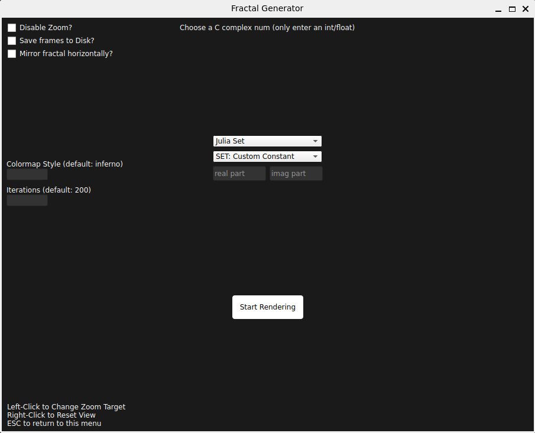
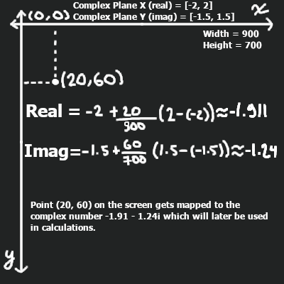
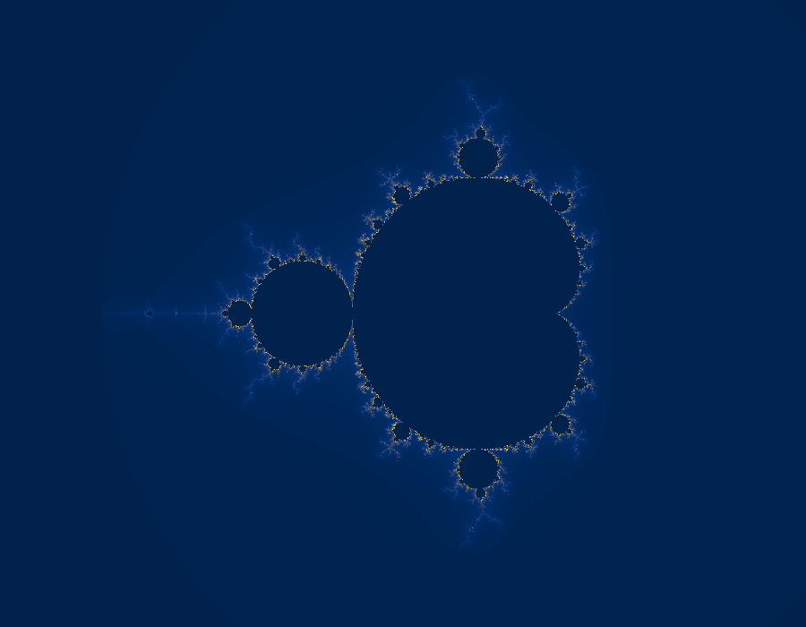

# Mandelbrot and Julia Set Fractal Generator

A fractal rendering program with a GUI that has the following functionality:

- **Toggle Zoom**
- **Save Frames to Disk**: saves each frame to a `frames` folder in the current directory in png format which then can be turned into a gif or mp4 with tools like ffmpeg.
- **Colormaps**: can be set to any colormap in the matplotlib `colormaps` dictionary.
Colormaps that work good with the fractals: `plasma`, `hot`, `magma`, `inferno`, `viridis`, `cividis`, `bwr`, `terrain`, `twilight_shifted`, `turbo`, `Spectral`, `seismic`, `copper`.
- **Iterations**: the amount of times it goes through the formula and the calculation process for each pixel.
- **A selection of different Julia Sets**

For more controls, class variables in `fract.py` can be modified.

## Requirements

- **Python >= 3.13**
- **matplotlib >= 3.10.9**
- **numba >= 0.65.1**
- **numpy >= 2.4.4**
- **PyQt6 >= 6.11.0**

To start the program run `script.sh` from the project directory.

## The Fractals

### Mapping Points To The Complex Plane

The function $f_{c}(z)=z^{2} + c$ is used for both fractals. For Mandelbrot Set each pixel is mapped to $c$ and starting at $z=0$ the set is defined to be the points that **do not** diverge to infinity when iterated, this is done by checking if $|z|$ goes beyond a certain value for the duration of max iterations. The pixels are colored based on what point in the iteration they diverged to infinity.

Same logic for Julia Sets but $c$ is given some constant value and the pixels are mapped to $z$ this time. 

### Julia Set at $c=-0.835-0.2321i$

### Julia Sets for $z^{2} + 0.7885e^{ia}$, where $a$ ranges from $0$ to $2\pi$

## Sources

- [Javalab Mandelbrot Set](https://javalab.org/en/mandelbrot_set_en/)
- [Shader Fractals](https://github.com/pedrotrschneider/shader-fractals#2d-fractals)
- [Julia Set Wiki](https://en.wikipedia.org/wiki/Julia_set)
- [Mandelbrot Set Wiki](https://en.wikipedia.org/wiki/Mandelbrot_set)
- [Fractal Wiki](https://en.wikipedia.org/wiki/Fractal)
- [GD Fractals](https://github.com/kiwijuice56/gd-fractals)

**NOTE**: This project was created for learning purposes and was not meant to be very optimized and flawless (everything runs on the CPU etc.), I didn't come up with most of the code about fractals and my main goal was just to learn about making GUI applications, graphical processing and the PyQt6 library, this is my first personal project. 
